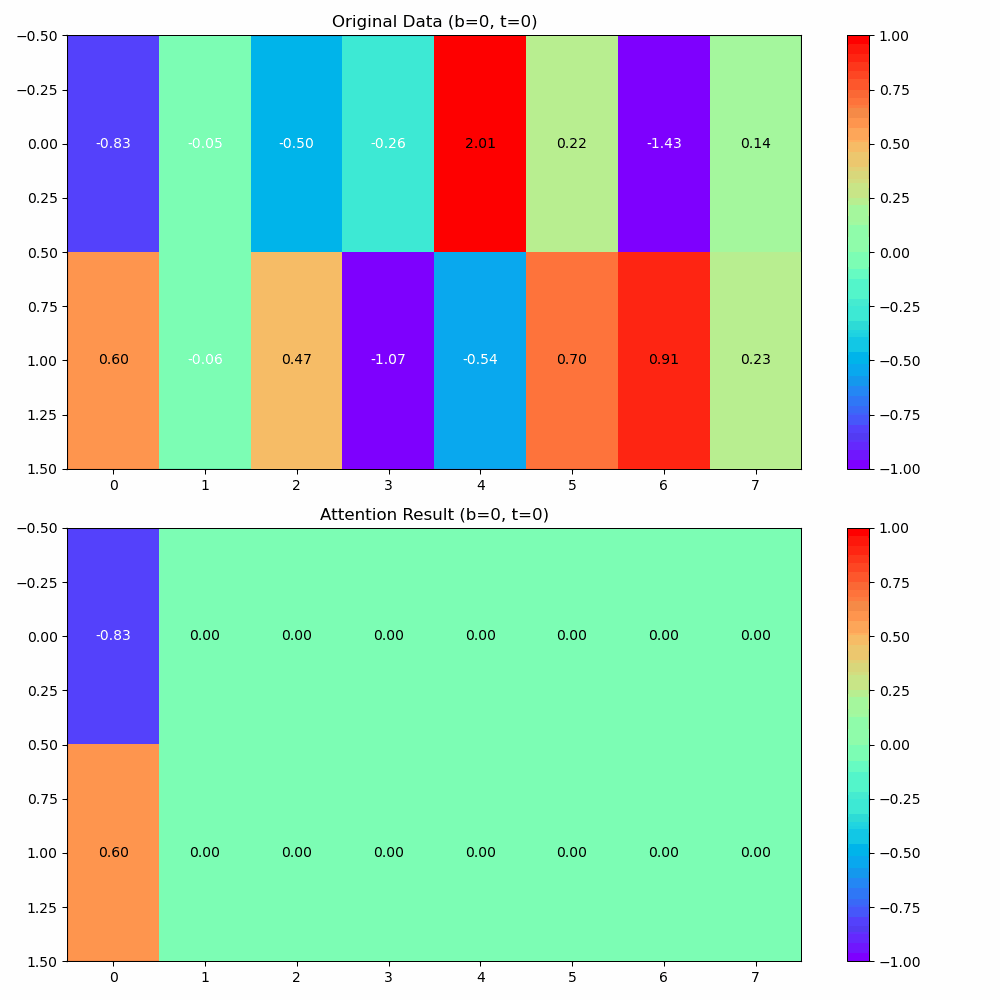

#  GPT from Scratch

This repository contains the implementation of a PyTorch-based decoder-only transformer, scaled to the level of a small-scale language model. Inspired by Andrej Karpathy's latest video on GPT, this project is build to understand the process of building a transformer model from scratch and scale. 

## Objectives of the project
* To build a Minimum Viable Product (MVP) end-to-end pipeline for training a language model.
* To implement an attention mechanism from scratch in PyTorch.
* To replicate the decoder structure of the Transformer with self-attention blocks.
* To scale the model for token-by-token prediction (character-level in this case).

For this project I have used shakespeare text data.


## Project Code

```bash
src
├── simple_bigram_model
│   ├── model.py
│   └── runSimpleBigram.py
├── single_attention_bigram_model
│   ├── model.py
│   └── runSingleAttention.py
├── multiheaded_attention_bigram_model
│   ├── model.py
│   └── runMultiAttention.py
├── GPT
│   ├── model.py
│   └── rungpt.py
├── data.py
├── dataloader.py
├── tokenizer.py
└── train.py
```

## Prerequisites

* python 3.12.4 
* conda

## Installations

I have create a conda requirements to install required dependencies:

```bash
conda create --name <yourenvname> --file requirements.txt

```

## Running the Models

I have added all configuration settings and hyperparameters are within the run files. To train and evaluate a model, run the following command with respective name of the model in the model directory.

```
  python runmodelname.py  
```


Attention Mechanism: 

```python
  import torch
  import torch.nn as nn
  import torch.nn.functional as F

  # Let's say we are feeding a batch of B tokens of length T with features of tokens C
  torch.manual_seed(2024)
  B, T, C = 4, 8, 32  # batch size, sequence length, feature dimension
  x = torch.rand((B, T, C))

  head_size = 16
  num_heads = C // head_size  # This is like grouped convolution but grouped attention to communicate well between the nodes

  # In a naive way of passing the information from past to current token is by taking the mean of the features 
  # and using them like a weight to see the importance of a given token in the context of the old token.
  # In this mean approach, all the tokens in a sentence are assigned the same values. But if we make this data-dependent, 
  # it would give dynamic and strength-based affinity scores.
  # Query, Key, Value step does exactly the same. Each token outputs query, key, value.

  # query -- what the token is interested in with given context
  # key --  here is what token has with given context
  # value --- if other tokens find the current token interesting, here is what the current token will communicate to the model about

  # This is the key to creating the attention or affinity scores.
  query = nn.Linear(C, head_size, bias=False)  # (C, head_size)
  key = nn.Linear(C, head_size, bias=False)  # (C, head_size)
  value = nn.Linear(C, head_size, bias=False)  # (C, head_size)

  # Each token outputs three values: q, k, v
  k = key(x)  # (B, T, head_size)
  q = query(x)  # (B, T, head_size)

  # We calculate the affinity scores by doing the dot product: like an asymmetric similarity check.
  # This will light up all the tokens that are related to others by giving high similarity score to that node.
  # To compensate for the sharpness of softmax issues, we normalize the weights by head_size to bring the weights to 
  # normalized values and avoid one-hot encoding of values.
  wei = q @ k.transpose(-2, -1) / head_size ** 0.5  # (B, T, head_size) @ (B, head_size, T) -> (B, T, T)
  # This is a decoder-only step so we need to make sure that the current token sees only the present and past tokens.
  # A lower triangular matrix does exactly the same in matrix multiplication.
  tril = torch.tril(torch.ones(T, T))
  wei = wei.masked_fill(tril == 0, float('-inf'))
  wei = F.softmax(wei, dim=1)
  v = value(x)  # (B, T, head_size)
  out = wei @ v  # (B, T, T) @ (B, T, head_size) = (B, T, head_size)


```

## This is a simple mean based attention 




## Results:
### Simple Bigram model:

```bash

    epoch:4800, train_loss:2.540316343307495, valid_loss:2.580368757247925

    #generated text: 
    Wourgo asake bokha pore byT, is t fr he.
    WI t -qussetullhwayour, heENIEDWak fomod
    Pulxcor hof s cond Wce ofy!
    MBus, BYBXF:

    ULUFuir l t, GI a; pRED b!
    Thavfoasatsat R pap; nd mbe ntimalhime-pawome,n t


```


### Single Head Attention Model:

```bash

  epoch:4800, train_loss:2.3642752170562744, valid_loss:2.4115657806396484

  #generated text: 
  WONMLoefinge
  F cuncas hacke con sst,
  Adois ogat whe pang filerve dpals shy I pae fory fangerer ncom ngou, fo ase
  Pree sikeve I, ay yoth my buke: bens tour tly heary thang lil thin tre swatt brthe,
  Afr


```


### Multi Head Attention Model:

```bash

  epoch:4800, train_loss:2.218127489089966, valid_loss:2.2772650718688965

  # generated text: 
  ucmotre I gright thas hacke come swcas, is of thave pris filesthat alser youdpak foremfadedifr queadn''d, fordse
  POLe,
  Rerve I ivery thomy buke: bens to my lish ary than thil the a re's atty pthe mufo


```


### Transformer Model with feedforwad, and layer norms:

```bash

epoch:4800, train_loss:2.085949659347534, valid_loss:2.172783136367798

# generated text: 

BENTERWICHANGHETIS:
Firs;
The hath rught.

JUCESTOLUSILENOS:
My such liughs emerosm. Way-urwfich it thomet! my noth him, Was.

RIXE:
O, you a oulf?.

DURGEONRIENET:
Hous pitus of gell mart merius Por


```

### GPT model

Thi model is a full blown stack of tranformers with following parameters
* block_size = 256 
* batch_size = 128 # batch size for the model
* max_iters = 5000 
* lr = 1e-4
* n_embed = 512
* n_heads = 8  ## this has to be a factor of n_embed as I am using multihead attention with n_embed/n_heads
* n_layers = 10
* dropout = 0.2

on NVIDIA A100 Gpu it took around 20mins to run the model from scartch. Definetly my models are overfitted. 

```bash

epoch:4800, train_loss:1.0582672357559204, valid_loss:1.635657787322998

# generated text: 

QUEEN ELIZABETH:
A foes, a day, that set based;
And, for then, how of the heavinest, if he had,
Had said are together, a foul servants
Aught a blind wench. Happy you number,
And you behold him of the each of our near
Brother kind refush.

FLORIZEL:
Comfort,
What, the matter.

PAULINA:
Come, come; Condith and you plant,--

VIRGILIANA:
Ready to the people.

First Lord:
Well, as it.

LEONTES:
We are no ta'quered you but you have good up,
But why  that hath slind in use mean for it?
Where was I amide enough myself? speak me an aims, I
A mayorr of your bodies, being up in these side
palt children and by, you accursed indeed,
If you discourated feedom and entreat that's not tended
provate all to fay, and so say 'be;' my mourn
To find 'it to be a word scoreptre than would good.
3 KING HENRY VI

KING EDWARD IV:
Pindonce, what was ever their intext?

GLOUCESTER:
But with a syim that is ramediem?

LADY ANNE:
Welcome, you should still be: that's the cook,
Alook at my mindeast, And bound him, that

Was says in the matter's sorrow confer in you
And ISaly have foundly a leguds prince;
And together, still you do, my Lord Lewis of North,
I can suffer the father. That seem it, her rest;
But, we pity, as it is, that a bound for a fault,
Were not Corioli, they nor made the fiar name?
Wherein He sentender by his victory's doom?
And my condemnd emparchance
Who uged in the crown.

MOPSSON:
Sir, Was it well? Hastings? what? ay!
Even doores, for your grace and safears
Had retined are the marvellous gentle born.

FLORIZEL:
We must I reprison to do sain;
Or be sickness form for your face, and you acceward
As if the new boorn my gain chomes to now
The smy stay with's untick his maname arms.

YORK:
And I, my tongue socies
In their that hundargement blames withal
Happied men look to for advanturate.

```


With each iteration and increase in model complexity, there's a noticeable improvement in validation loss and the quality of generated text. Although the generated text is not perfect English, clear patterns and structures are clear as the models become more complex.